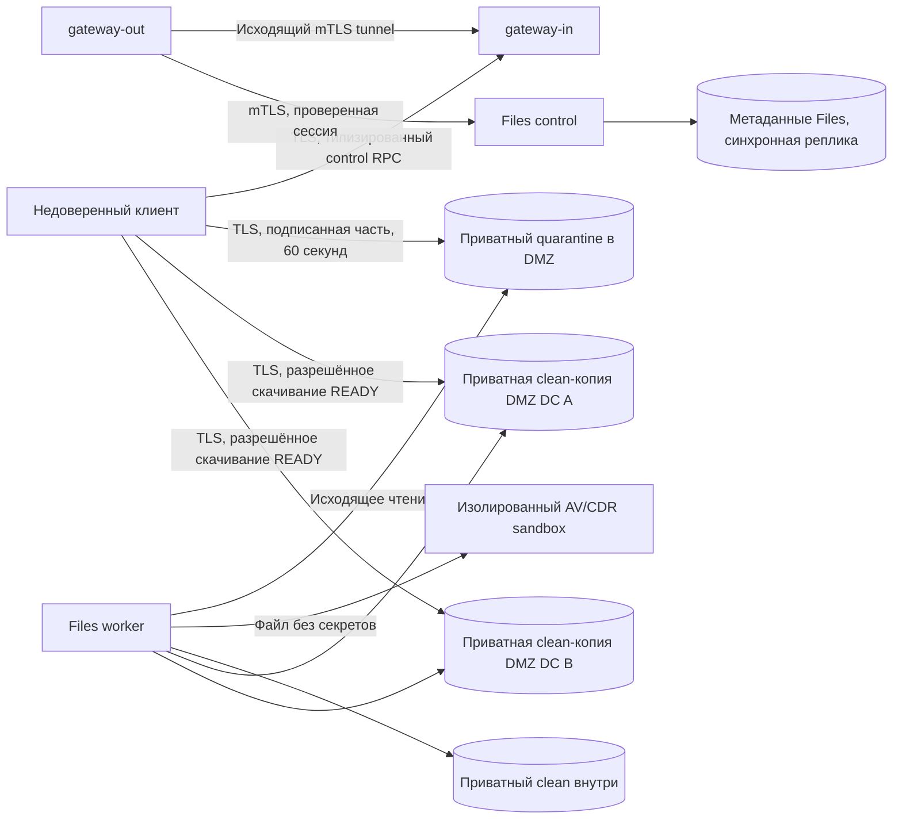

# ADR-0015: Приватный файловый data plane

- Статус: Предложено; публичные маршруты выключены до проверки реализации
- Дата: 2026-09-21
- Задача: MM-43
- Уточняет: ADR-0009

## Контекст и область решения

RPC-туннель уже обслуживает аутентификацию, предметные запросы и realtime.
Передача файлов через его очереди увеличила бы память шлюзов и время ответа
несвязанных операций. Пользователь согласовал изображения, PDF и офисные
документы размером до 100 МиБ. Файл является недоверенным даже после проверки
сессии владельца.

Начальный allowlist: JPEG, PNG, PDF, DOCX, XLSX, PPTX, ODT, ODS и ODP.
Бинарные DOC/XLS/PPT, документы с макросами, зашифрованные документы и обычные
архивы отклоняются. Поддержка новых форматов требует отдельной политики CDR
и отрицательных тестов. Имя клиента не используется в object key и не
передаётся конвертеру. Клиент не выбирает bucket, endpoint, tenant или owner.

## Решение

Отдельный сервис Files управляет метаданными и конечным автоматом в своей
логической PostgreSQL database. S3-адаптер использует SeaweedFS с обязательной
проверкой совместимости конкретного image digest. Заявленная совместимость
с S3 не заменяет тесты подписи, checksum, условной записи и multipart.

Туннель переносит только FILE_CREATE_UPLOAD, FILE_COMPLETE_UPLOAD,
FILE_GET_STATUS, FILE_CREATE_DOWNLOAD и FILE_DELETE. В protobuf отсутствуют
байты файлов, произвольный URL, имя RPC или путь. Повторный Create с тем же
идемпотентным ключом и тем же manifest возвращает ту же сессию и обновлённые
capabilities непринятых частей; иной manifest даёт конфликт.

Сервер создаёт случайные идентификатор и object key. Manifest заранее
фиксирует MIME, полный размер, SHA-256 объекта и SHA-256 каждой части.
Часть не превышает 5 МиБ; последняя может быть меньше. URL подписывает
метод, точный bucket/key части, размер, checksum, `If-None-Match: *`,
SSE-KMS key и TTL. Upload ID принадлежит серверному manifest. Каждая часть
хранится отдельным неизменяемым S3 объектом; её нельзя перезаписать даже теми
же байтами. Complete проверяет HEAD всех частей и атомарно меняет состояние
в PostgreSQL. Worker собирает исходник из частей и повторно проверяет SHA-256
каждой части и всего файла. Байты проходят только через файловый контур.

Проверка SeaweedFS 4.41 с TLS/OpenBao показала: native `ListParts` не возвращает
SHA-256, хотя `UploadPart` проверяет его. Исходники 4.47 имеют то же ограничение.
У обычного conditional PUT SHA-256 доступен через HEAD. Поэтому выбран
resumable-протокол с неизменяемыми объектами частей вместо native S3 multipart;
изменение не ослабляет контроль целостности при возобновлении. Lifecycle
удаляет просроченные объекты частей по TTL карантина.

Состояния: UPLOADING → SCANNING → REPLICATING → READY; отдельные терминальные
состояния REJECTED, EXPIRED и DELETED. Переходы имеют проверку версии в БД.
Удаление сначала фиксирует tombstone и запрещает новые capabilities; ответ
подтверждает эту запись. Отдельный worker идемпотентно удаляет все копии. Ни worker после рестарта, ни повторный Complete
не могут вернуть удалённый объект в READY. Сканирование и очистка переживают
потерю процесса через durable состояние и ограниченные leases.

READY требует полной проверки SHA-256, положительного AV, успешного CDR и
проверенной записи clean-объекта в обеих DC. Недоступная DC оставляет состояние
REPLICATING. При потере подтверждения операции выполняется чтение состояния,
а не предположение об успехе. Метаданные подтверждаются только синхронно
реплицируемой транзакцией. Один локальный PostgreSQL не доказывает DC failover.

## Проверка содержимого

Сначала отдельный sandbox проверяет структуру и строит пассивную производную.
Затем AV сканирует и исходник, и производную; обе проверки обязательны перед
записью clean. Недоступность, устаревшие сигнатуры, timeout и неоднозначный ответ
не означают CLEAN. MIME проверяется по содержимому и структуре контейнера.

В live-тесте ClamAV 1.4.3 вернул OK для ZIP с распаковкой более 512 МиБ,
несмотря на `AlertExceedsMax`. Это совпадает с ограничением
[ClamAV #633](https://github.com/Cisco-Talos/clamav/issues/633);
[PCRE limits #1785](https://github.com/Cisco-Talos/clamav/issues/1785) также
не покрываются этой настройкой. Поэтому ответ OK не считается доказательством
полноты структурной обработки: независимые лимиты ZIP/CDR обязательны.
Сканер обновлён до официального ClamAV 1.5.4; ограничения сохраняются и
проверяются отрицательными тестами, независимо от версии AV.

Изображения декодируются с лимитом пикселей и заново кодируются без EXIF.
Офисные документы проходят структурную проверку ZIP: имена, дубликаты,
суммарный распакованный размер, отношение сжатия, CRC, внешние связи,
вложенные архивы, макросы и embedded objects. Офисный документ преобразуется
в PDF, PDF — в изображения страниц, из которых собирается новый PDF.
Именно очищенная производная доступна пользователю: макросы, вложения,
скрипты, ссылки и интерактивные формы не сохраняются. Цифровые подписи и
редактируемость исходного документа также не сохраняются. Исходник никогда
не выдаётся через download API.

Парсеры работают в отдельном непривилегированном процессе/контейнере с
read-only root, временным хранилищем, лимитами CPU/RAM/PID/времени и без
сетевого доступа, ключей S3/KMS, БД и бизнес-сервисов. Worker передаёт в sandbox
только ограниченный поток байтов и получает ограниченные raw RGB кадры.
PNG/PDF собирает собственный минимальный encoder worker: он не разбирает
PDF/Office, возвращённый недоверенным конвертером. Sandbox принимает ровно
одно задание; после него контейнер завершается, включая оставшиеся процессы. Доступ
к Docker socket из worker запрещён.

## Классификация данных и границы доверия

| Данные | Класс и обращение |
| --- | --- |
| Исходник и clean-производная | Приватные пользовательские данные; TLS, SSE-KMS, срок хранения и удаление |
| Manifest, owner, tenant, object key | Внутренние метаданные; только Files и соответствующие роли worker |
| Подписанный URL и multipart upload ID | Краткоживущая capability; `no-store`, без логов, трассировок и аналитики |
| Ключи подписи S3, KMS и X.509 | Секреты среды; файлы с ограниченными правами/secret manager, отдельные роли |
| Аудит | Идентификатор операции, случайный file ID, переход состояния, конечная причина; без содержимого, имени, URL и токенов |

Каждая control-операция повторно проверяет текущую Auth-сессию и принадлежность
объекта. На первом этапе личный tenant определяется подтверждённым subject,
а не параметром запроса. Межорганизационные ACL не выводятся из существования
file ID. При недоступном Auth доступ закрыт.

Quarantine, внутренний clean и DMZ clean имеют отдельные IAM-политики.
Upload principal получает только загрузку частей; без Get/List/Delete.
Download principal читает только clean. Удаление и обработка имеют свои роли.
SSE-KMS использует разные ключи для quarantine/clean и разных окружений.
Временный KMS локального теста не считается production key management.

Рабочая идентичность связывает trust domain, environment, cluster, namespace
и service account с проверенной X.509 URI SAN. Сертификаты короткоживущие;
pod UID является только аудитным атрибутом и не выдаёт права. Роль из HTTP
заголовка или просто успешный TLS handshake не заменяет авторизацию workload.

## STRIDE

| Угроза | Защита и отрицательная проверка |
| --- | --- |
| S: чужая сессия/tenant или workload | Повторная проверка Auth, owner в каждой транзакции, точная X.509 identity; cross-owner и cross-environment тесты |
| T: изменение размера/части/key/TTL | Подпись всех ограничений, checksum частей/объекта, условное завершение; tamper/replay/concurrent tests |
| R: двойная бизнес-операция | Уникальный owner/idempotency key, manifest fingerprint, CAS состояния и конечный аудит |
| I: URL в логах, чтение карантина | Закрытые buckets, отдельные principals, `no-store`, отсутствие тел/URL в telemetry; аудит выходов и IAM negative tests |
| D: ZIP/pixel/page bomb, медленный upload | Ограниченный manifest, размер/время/квоты, лимиты распаковки и sandbox; oversized/bomb/timeout tests |
| E: exploit AV/CDR, макросы и SSRF | Изолированный sandbox без сети/секретов, запрет external relationships, реконструкция; сетевые negative tests |

## Эксплуатация и альтернативы

Незавершённые uploads живут не более суток, обработка — до 48 часов от
создания. Lifecycle quarantine удаляет исходники через 3 дня; worker раньше
очищает READY и терминальные сессии, включая проигравшие clean-кандидаты.
Квота владельца — 10 активных uploads и 100 новых в сутки. Tombstones сохраняются дольше максимального TTL capability.
Выданный S3 download URL является bearer capability и действует до своего
короткого expiry (до 60 секунд); ускоренный отзыв требует удаления доступных
копий или отзыва capability principal. Ответ Delete означает tombstone,
а не подтверждение стирания каждой недоступной копии.
При недоступной DC Delete остаётся ожидающим очистки и не выдаёт новые URL.

Рассмотрены: байты в текущем RPC-туннеле (нарушает изоляцию), публичный bucket
(невозможна повторная авторизация), один storage для DMZ и внутренней зоны
(общий радиус компрометации). Отдельный file-gateway с собственными процессами,
сертификатами и очередями допустим только если эксплуатация запрещает прямой
подписанный S3 endpoint; это отдельное решение, а не расширение RPC-туннеля.

## Условия принятия и включения

ADR принимается до включения API после проверки backend и сетевых границ.
Публичный feature flag остаётся выключенным до независимого security review
и полного E2E с двумя DC, отказами tunnel/pod/DC, AV/CDR, сохранностью
метаданных и проверкой IAM/KMS. Локальные unit-тесты и наличие compose-файла
сами по себе эти условия не выполняют.

Основания: [ADR-0009](0009-object-storage-across-trust-zones.md),
[S3 conditional operations](https://github.com/seaweedfs/seaweedfs/wiki/S3-Conditional-Operations),
[CompleteMultipartUpload](https://docs.aws.amazon.com/AmazonS3/latest/API/API_CompleteMultipartUpload.html),
[ClamD protocol](https://docs.clamav.net/manual/Usage/ClamdProtocol.html),
[LibreOffice CLI](https://help.libreoffice.org/latest/en-GB/text/shared/guide/start_parameters.html).
